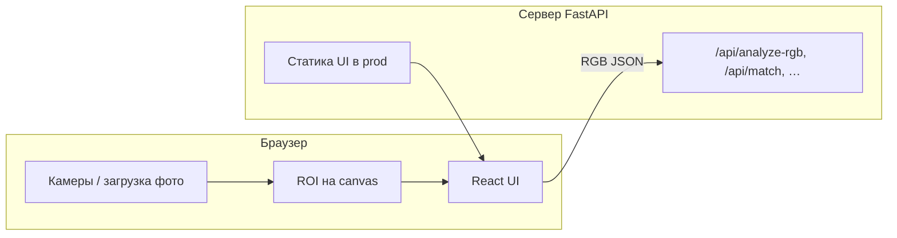

# Помощник смешивания цветов

**Color Mixing Assistant** — веб-приложение для художников и миниатюристов: сравнение двух цветов с камеры или снимка, расчёт ΔE и подсказка, какие базовые краски добавить к палитре, чтобы приблизиться к целевому оттенку.

Камеры и выбор области (ROI) работают **в браузере**; сервер получает только RGB и возвращает анализ цвета и рекомендации по смешиванию.

---

## Содержание

- [Задачи, которые решает](#задачи-которые-решает)
- [Технологии](#технологии)
- [Архитектура](#архитектура)
- [Требования](#требования)
- [Разработка (локально)](#разработка-локально)
- [Развёртывание (Docker / NAS)](#развёртывание-docker--nas)
- [Переменные окружения](#переменные-окружения)
- [API и документация](#api-и-документация)
- [Тесты и Quality Gate](#тесты-и-quality-gate)
- [Структура репозитория](#структура-репозитория)
- [Дорожная карта](#дорожная-карта)

---

## Задачи, которые решает

| Задача | Как реализовано |
|--------|------------------|
| Снять цвет с миниатюры, фото или палитры | Две панели: **камера 1 (цель)** и **камера 2 (палитра)** через `getUserMedia`, захват кадра или **загрузка изображения** |
| Сравнить «насколько близко» | **ΔE (CIE 2000)** между цветом палитры и целевым |
| Понять, что добавить в смесь | До трёх базовых красок из активного набора с относительными долями (не точные объёмы) |
| Свои наборы красок | Пользовательские пресеты в `localStorage`, импорт/экспорт JSON; серверные наборы (Classic, Winsor & Newton и др.) — только чтение |
| Стабильные подсказки при дрожании камеры | Режим **«Сглаживание»** в блоке смешивания: обновление при изменении ΔE > 1 после нового замера |
| Работа без установки Python у пользователя | Прод: один Docker-образ (UI + API на порту 8000) |

**Ограничения (осознанные):** нет компенсации освещения, управления фокусом, учёта объёма краски на палитре и силы пигментов — только направление для коррекции оттенка.

---

## Технологии

| Слой | Стек |
|------|------|
| **Frontend** | React 19, TypeScript, Vite 6, Vitest |
| **Backend** | Python 3.12, FastAPI, Uvicorn, Pydantic, colour-science |
| **Камеры** | Browser MediaDevices API (`getUserMedia`) — сервер камер не открывает |
| **Контейнер** | Multi-stage Dockerfile (`node:22-alpine` → `python:3.12-slim-bookworm`) |
| **i18n** | RU / EN, ключи в `frontend/src/i18n/locales/` |

---

## Архитектура



- **Dev:** Vite на `:5173`, API на `:8000`, прокси `/api` в `vite.config.ts`.
- **Prod:** собранный фронт отдаётся из `COLOR_MATCHER_STATIC_DIR`; запросы к `/api/*` — тот же origin.
- Пользовательские палитры **не хранятся на сервере** — только в браузере; в `POST /api/match` передаётся активный список `baseColors`.

Подробнее о выборе браузерных камер: [onlineCam.md](onlineCam.md).

---

## Требования

**Локальная разработка**

- Python 3.10+ (рекомендуется 3.12)
- Node.js 20+ (LTS)
- Современный браузер с поддержкой камеры (Chrome, Edge, Firefox)

**Прод / NAS**

- Docker 24+ с BuildKit
- Reverse proxy с TLS (nginx, Traefik, Synology Application Portal и т.п.) — рекомендуется для доступа из интернета

---

## Разработка (локально)

### Windows (PowerShell)

```powershell
git clone <url> color-matcher
cd color-matcher
.\scripts\setup.ps1
```

В **двух** терминалах:

```powershell
.\scripts\start-backend.ps1   # http://127.0.0.1:8000/docs
.\scripts\start-frontend.ps1  # http://localhost:5173
```

### Linux / macOS

```bash
git clone <url> color-matcher
cd color-matcher
chmod +x scripts/*.sh    # один раз
./scripts/setup.sh
```

В двух терминалах:

```bash
./scripts/start-backend.sh
./scripts/start-frontend.sh
```

Откройте **http://localhost:5173** и разрешите доступ к камере.

| Скрипт | Назначение |
|--------|------------|
| `setup.ps1` / `setup.sh` | venv + `pip install` + `npm install` |
| `start-backend.*` | Uvicorn с `--reload` |
| `start-frontend.*` | Vite dev server |
| `test.ps1` / `test.sh` | pytest + vitest (QG v1) |
| `qg.ps1` / `qg.sh` | Quality Gate v1–v3 |

---

## Развёртывание (Docker / NAS)

Один контейнер: **UI + API** на порту **8000**. Образ `production` собирается только после успешного stage **`test`** (pytest, vitest, i18n, OpenAPI).

### Сборка

```bash
./scripts/docker-build.sh
```

Windows:

```powershell
.\scripts\docker-build.ps1
```

Включён **Docker BuildKit**; `npm ci` при сетевых сбоях повторяется до 5 раз.

### Запуск

```bash
cp .env.example .env   # при необходимости отредактируйте порт
docker compose up -d --build
```

Или без compose:

```bash
./scripts/docker-run.sh
# Windows: .\scripts\docker-run.ps1
```

- UI: `http://<хост>:8000/`
- Health: `GET /api/health`
- Swagger: `http://<хост>:8000/docs`

### Доступ по домену (NAS + интернет)

1. Опубликуйте контейнер только во внутренней сети (например `127.0.0.1:8000` или порт NAS).
2. Настройте **reverse proxy** с HTTPS на ваш домен.
3. При необходимости задайте `COLOR_MATCHER_CORS_ORIGINS` (если UI и API на разных origin; при одном домене обычно не нужно).
4. Камера по HTTPS: для `getUserMedia` нужен **безопасный контекст** (HTTPS или localhost).

---

## Переменные окружения

Префикс: `COLOR_MATCHER_`.

| Переменная | По умолчанию | Описание |
|------------|--------------|----------|
| `HOST` | `127.0.0.1` (dev) / `0.0.0.0` (Docker) | Адрес Uvicorn |
| `PORT` | `8000` | Порт API и UI в prod |
| `STATIC_DIR` | пусто (dev) / `/app/static` (Docker) | Каталог со сборкой Vite |
| `CORS_ORIGINS` | `http://localhost:5173,…` | Список origin через запятую |
| `ROI_SIZE` | `48` | Размер ROI по умолчанию (px) |

В `docker-compose.yml` порт публикации: `COLOR_MATCHER_PUBLISH_PORT` (см. `.env.example`).

---

## API и документация

| Ресурс | Путь |
|--------|------|
| OpenAPI JSON | [docs/openapi.json](docs/openapi.json) |
| Swagger UI | `/docs` (на работающем API) |
| Регенерация схемы | `python scripts/export_openapi.py` |
| Проверка актуальности | `python scripts/check_openapi_drift.py` |

Основные эндпоинты: `GET /api/health`, `GET /api/config`, `POST /api/analyze-rgb`, `POST /api/match`, `GET /api/palette-presets`.

---

## Тесты и Quality Gate

```powershell
.\scripts\qg.ps1           # v1 + v2 + v3
.\scripts\qg.ps1 -Stage v1 # только pytest + vitest
```

```bash
./scripts/qg.sh all
```

| Этап | Проверки |
|------|----------|
| **v1** | `pytest` (backend), `vitest run` (frontend) |
| **v2** | паритет ключей `en` / `ru` |
| **v3** | `docs/openapi.json` совпадает со схемой FastAPI |

Stage **`test`** в Dockerfile выполняет те же проверки перед образом `production`.

---

## Структура репозитория

```
color-matcher/
├── backend/app/          # FastAPI: color, mixer, palette_presets, schemas
├── backend/tests/
├── frontend/src/         # React: камеры, ROI, палитры, смешивание
├── docs/openapi.json
├── scripts/              # setup, start, qg, docker-*
├── Dockerfile            # targets: test | production
├── docker-compose.yml
└── ROADMAP.md
```

---

## Дорожная карта

Планы и статус задач: [ROADMAP.md](ROADMAP.md).

---

## Участие

Перед PR: `.\scripts\qg.ps1` (или `./scripts/qg.sh all`). При изменении API: `python scripts/export_openapi.py`.
