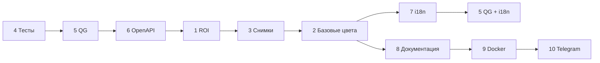

# Roadmap — Color Matcher

Список доработок по **фазам**. Нумерация разделов ≈ рекомендуемый порядок работ.

---

## Фазы (кратко)

| Фаза | Разделы | Зачем |
|------|---------|--------|
| **A. Основа** | 4 → 5 → 6 | Тесты и QG до крупных рефакторингов; контракт API |
| **B. Ядро продукта** | 1 → 3 | Исправить захват/ROI; зафиксировать политику снимков |
| **C. Базовые цвета** | 2 | CRUD → импорт/экспорт → добавление с камеры |
| **D. UX и документация** | 7 → 8 | i18n; архитектура (черновик можно вести с фазы A) |
| **E. Доставка** | 9 | Docker / один скрипт, QG в сборке |
| **F. Расширения** | 10 | Telegram |



---

## 1. Исправить ROI на снимке (режим захвата)

**Проблема:** при захвате кадра ROI на экране не совпадает с выборкой цвета.

**Проверить:**

- [ ] Координаты overlay vs JPEG: `naturalWidth`/`naturalHeight` ≠ `frameWidth`/`frameHeight`
- [ ] Letterboxing (`object-fit: contain`) — поля не учтены в кликах и отрисовке
- [ ] Цвет с canvas, рамка в другой системе координат
- [ ] На бэкенде ROI на live, в UI — старый JPEG захвата

**Критерий:** сдвиг ROI на снимке меняет цвет ровно из видимой области.

**Тесты (п. 4):** unit-тесты `sampleImageColor` и маппинга координат — желательно добавить вместе с фиксом.

**Блокирует:** п. 2.3 (цвет с палитры), п. 10 (бот по фото).

---

## 2. Базовые цвета (эпик)

Один эпик, три шага **строго по порядку** — общий API и `base_colors.json`.

### 2.1 CRUD в UI

- [ ] Секция «Базовые краски»: имя + RGB (ручной ввод)
- [ ] Добавление / удаление / переименование
- [ ] API `GET/PUT` (или аналог) + сохранение на бэкенде
- [ ] Подсказка смешивания использует актуальный список

### 2.2 Импорт и экспорт файла

- [ ] Экспорт JSON (текущий набор)
- [ ] Импорт с валидацией схемы (тот же формат, что `base_colors.json`)
- [ ] Режимы: «заменить всё» / «добавить к существующим», предпросмотр
- [ ] Понятные ошибки (битый файл, неверные поля)

*Зависит от 2.1 — те же эндпоинты и модель данных.*

### 2.3 Добавление цвета со снимка палитры

- [ ] «Добавить из ROI» — RGB с камеры палитры, не ручной ввод
- [ ] Имя краски + сохранение в список (через API из 2.1)
- [ ] Опционально: усреднение по нескольким кадрам

*Зависит от п. 1 (ROI на снимке) и п. 2.1.*

**Не дублировать:** ручной RGB — только в 2.1; с камеры — только в 2.3.

---

## 3. Политика работы со снимками

**Тип:** архитектурное решение (ADR), не фича UI. Зафиксировать **до** Docker и Telegram.

| Вариант | Плюсы | Минусы |
|--------|--------|--------|
| Только в браузере (blob, canvas) | Нет загрузки на сервер | Нет серверного архива |
| Кратковременно на бэкенде (RAM / temp) | Один код анализа | Нужна очистка |
| Файлы в temp с TTL | Удобно отлаживать | Риск мусора на диске |

**Решение для MVP без логина:**

- [ ] Захват **клиентский** (как сейчас), если не выбран иной вариант осознанно
- [ ] При серверном хранении: UUID, TTL, лимиты размера и числа объектов, очистка при рестарте
- [ ] Не хранить снимки между сессиями без явного экспорта пользователем
- [ ] Краткий абзац в README → подробности в п. 8

**Критерий:** понятно, где лежат данные; нет накопления мусора.

**Связь с п. 10:** если бот принимает фото — применить те же лимиты и TTL из этого раздела.

---

## 4. Тесты

**Цель:** покрыть стабильную логику до доработок базовых цветов и i18n.

**Бэкенд (pytest):**

- [ ] `color.py` — Lab, ΔE
- [ ] `mixer.py` — смешивание, краевые случаи
- [ ] `roi.py` / `roi_state.py` — square/polygon, сериализация
- [ ] API: `match`, `roi/{role}`, `analyze-rgb` (FastAPI TestClient)
- [ ] Фикстура `base_colors.json` для тестов

**Фронтенд (Vitest):**

- [ ] `sampleImageColor`, маппинг ROI (усилить при п. 1)
- [ ] Smoke: `MixSuggestion`, `RoiOverlay` (без камеры)
- [ ] Моки `fetch` в `api.ts`

**Позже (отдельный подпункт, не блокирует MVP):**

- [ ] Playwright E2E
- [ ] CI на push/PR — **вызывает скрипт QG (п. 5)**, не дублирует его логику

---

## 5. Quality Gate (QG)

**Цель:** одна команда перед PR / сборкой образа.

| Этап | Когда включать | Проверки |
|------|----------------|----------|
| **QG v1** | Сразу после п. 4 | `pytest`, `vitest run`, опционально lint |
| **QG v2** | После п. 7 (i18n) | + паритет ключей `locales/*/translation.json` |
| **QG v3** | После п. 6 | + актуальность `docs/openapi.json` (diff или регенерация) |

**Реализация:**

- [ ] `scripts/qg.sh` и `scripts/qg.ps1` — единая точка входа
- [ ] `scripts/check-i18n-keys.*` — только в QG v2
- [ ] Pre-commit — опционально, те же проверки что QG v1/v2
- [ ] Docker / CI — stage `test`, вызов `qg` (см. п. 9)

**Критерий:** скрипт падает при падении тестов; после i18n — при пропущенном ключе.

*i18n в QG до появления переводов (п. 7) не включать — иначе ложные падения.*

---

## 6. OpenAPI бэкенда

**Отличие от п. 8:** здесь — **машиночитаемый контракт**; в архитектурной доке — ссылка и смысл потоков.

- [ ] `summary` / `description` / теги на всех эндпоинтах
- [ ] Pydantic-модели с примерами
- [ ] Задокументированные aliases query (`targetR`, …)
- [ ] `docs/openapi.json` в репо; обновление в **QG v3** или при релизе
- [ ] Опционально: `openapi-typescript` для фронта
- [ ] `/api/v1/...` — только при планируемых breaking changes

**Вести вместе с п. 2.1** (новые эндпоинты базовых цветов сразу в схеме).

---

## 7. i18n на фронтенде

- [ ] `react-i18next` (или аналог), `locales/en`, `locales/ru`
- [ ] Язык: `navigator.language` → fallback `en`
- [ ] Опционально: переключатель + `localStorage`
- [ ] Строки UI только через ключи; `Intl` для чисел/процентов

**После внедрения:** включить **QG v2** (паритет ключей).

*Делать после стабилизации основных экранов (п. 1–2), иначе двойная работа по переводу.*

---

## 8. Документация по архитектуре

**Файлы:** `docs/architecture.md`, при необходимости `docs/deployment.md`.

**Содержание (без дублирования других разделов):**

- [ ] Обзор, стек, границы системы
- [ ] C4 / контейнеры (браузер, API, камеры, `base_colors.json`)
- [ ] Потоки данных (Mermaid): snapshot → ROI → match; capture → canvas → analyze-rgb; базовые цвета
- [ ] Ссылка на **п. 3** (политика снимков) и **п. 6** (`openapi.json`)
- [ ] Развёртывание — **кратко**; детали Docker → **п. 9**

**Вести итеративно:** черновик с фазы A, дополнять после п. 1–3 и п. 9.

---

## 9. Единый запуск и Docker

- [ ] `Dockerfile` (frontend build → static, backend + uvicorn)
- [ ] `docker-compose.yml`
- [ ] `scripts/start.ps1` / `.bat` — локально без Docker (venv + npm)
- [ ] `.env.example`
- [ ] Stage **QG** в образе / CI перед publish
- [ ] USB-камеры: Linux в контейнере; Windows — чаще native-скрипт (зафиксировать в п. 8)

*Зависит от зафиксированной политики снимков (п. 3) и рабочего QG v1 (п. 5).*

---

## 10. Telegram-бот / навык

**Вне MVP десктопа.** Сценарии (выбрать один для старта):

- **A.** Фото в чат → цвет в фиксированном ROI (проще)
- **B.** Десктоп шлёт результат на API → бот показывает по коду сессии
- **C.** Бот на машине со стендом: `/capture`, `/match`

- [ ] aiogram / python-telegram-bot + общий FastAPI
- [ ] Whitelist `chat_id` или токен в `.env` (без полноценной авторизации)
- [ ] Rate limit, лимит размера фото, TTL — по **п. 3**

**Зависит от:** п. 1, п. 2, п. 3, желательно п. 6–7.

---

## Порядок работ (чеклист)

```
Фаза A   [ ] 4 Тесты (минимум)  →  [ ] 5 QG v1  →  [ ] 6 OpenAPI (базово)
Фаза B   [ ] 1 ROI  →  [ ] 3 Политика снимков (ADR + README)
Фаза C   [ ] 2.1 CRUD  →  [ ] 2.2 импорт/экспорт  →  [ ] 2.3 с камеры
         [ ] 6 OpenAPI — дополнить эндпоинтами базовых цветов
Фаза D   [ ] 7 i18n  →  [ ] 5 QG v2
         [ ] 8 Документация (параллельно, финализировать после C)
Фаза E   [ ] 9 Docker + QG в CI  →  [ ] 5 QG v3 (openapi.json)
Фаза F   [ ] 10 Telegram
```

---

## Заметки

- Авторизации пользователей в MVP **нет**; доступ — локальная сеть, whitelist, env.
- Industrial-камеры (GenICam) — отдельный эпик после п. 9.
- Старые номера разделов (до ревизии): 1→1, 2–4→2.x, 5→3, 6→9, 7→10, 8→7, 9→4, 10→5, 11→8, 12→6.

*Обновлено: 2026-05-23*
