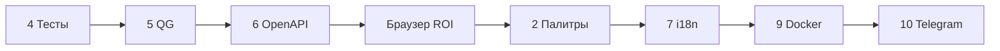

# Roadmap — Помощник смешивания цветов

Статус задач по фазам. Обновлено под текущую кодовую базу (ветка `develop`, 2026-05).

---

## Сводка по фазам

| Фаза | Разделы | Статус |
|------|---------|--------|
| **A. Основа** | 4 → 5 → 6 | ✅ Тесты (база), QG v1–v3, OpenAPI |
| **B. Ядро UX** | 1, 3 | ✅ Захват/ROI в браузере; ⏳ ADR по снимкам |
| **C. Базовые цвета** | 2 | ✅ MVP (пресеты, localStorage, импорт, с камеры) |
| **D. UX и доки** | 7, 8 | ✅ i18n RU/EN; ⏳ architecture.md |
| **E. Доставка** | 9 | ✅ Docker, скрипты Win/Linux/macOS |
| **F. Расширения** | 10 | ⏳ Telegram |



---

## 1. ROI и захват в браузере — ✅ сделано

- [x] Две панели камер, независимый `deviceId`, захват кадра / live
- [x] ROI: квадрат и полигон, выборка на canvas
- [x] Загрузка изображения вместо камеры (режим захвата)
- [x] Цвет с захваченного кадра пересчитывается при смене ROI
- [ ] Доп. unit-тесты геометрии ROI — по мере необходимости

*Серверные snapshot/MJPEG сняты с архитектуры; см. [onlineCam.md](onlineCam.md).*

---

## 2. Базовые цвета — ✅ MVP

### 2.1 Наборы и редактирование

- [x] Секция «Базовые цвета»: выбор набора, редактор имён и HEX
- [x] Серверные пресеты (`GET /api/palette-presets/{id}`) — read-only в UI
- [x] Пользовательские наборы в `localStorage`, минимум 3 цвета в наборе
- [x] `POST /api/match` с `baseColors` из браузера
- [ ] Опционально: синхронизация пользовательских наборов на сервер (аккаунты)

### 2.2 Импорт и экспорт

- [x] Экспорт / импорт JSON (bundle `version: 1`)
- [x] Валидация схемы, перезапись по совпадающим именам

### 2.3 Цвет с камер

- [x] Кнопки «Ц» / «П» — подставить RGB с камеры цели / палитры
- [x] Сохранение нового пользовательского набора из текущих цветов

---

## 3. Политика работы со снимками — ⏳ ADR

**Текущее решение (de facto):**

- Захват и blob-URL — **только в браузере**; на сервер уходят RGB.
- [ ] Оформить краткий ADR в `docs/` и ссылку из README
- [ ] Явные лимиты, если появится серверное хранение (Telegram, upload)

| Вариант | Статус |
|--------|--------|
| Только браузер (blob, canvas) | ✅ используется |
| Temp на сервере | не планируется в MVP |
| Файлы с TTL | не планируется в MVP |

---

## 4. Тесты — 🟡 частично

**Бэкенд (pytest):**

- [x] `color.py`, `mixer.py` (базово)
- [x] API: health, match, palette-presets
- [ ] Расширить краевые случаи mixer / ΔE

**Фронтенд (Vitest):**

- [x] `sampleImageColor`, `validate`, `hex`, `preciseMatch`, i18n parity
- [ ] Smoke-компоненты (RoiOverlay, MixSuggestion) с моками
- [ ] Playwright E2E — позже
- [ ] CI на GitHub Actions — вызывать `qg` / `docker build --target test`

---

## 5. Quality Gate — ✅ сделано

| Этап | Статус | Проверки |
|------|--------|----------|
| **QG v1** | ✅ | `pytest`, `vitest run` |
| **QG v2** | ✅ | `check_i18n_keys.py` |
| **QG v3** | ✅ | `check_openapi_drift.py` |
| **Docker stage `test`** | ✅ | то же в образе перед `production` |
| Pre-commit | ✅ | i18n hook (опционально) |

Скрипты: `scripts/qg.ps1`, `scripts/qg.sh`, `scripts/test.ps1`, `scripts/test.sh`.

---

## 6. OpenAPI — ✅ сделано

- [x] Pydantic-схемы, теги, описания
- [x] `docs/openapi.json`, `export_openapi.py`, `check_openapi_drift.py`
- [ ] `openapi-typescript` для фронта — опционально
- [ ] `/api/v1/...` — при breaking changes

---

## 7. i18n — ✅ сделано

- [x] RU / EN, `I18nProvider`, переключатель в шапке
- [x] `localStorage`, авто по языку браузера
- [x] QG v2 — паритет ключей

---

## 8. Документация по архитектуре — ⏳

- [x] README.md (GitHub: описание, стек, развёртывание)
- [ ] `docs/architecture.md` — C4, потоки данных
- [ ] `docs/deployment.md` — NAS, TLS, reverse proxy (можно вынести из README)

---

## 9. Запуск и Docker — ✅ сделано

- [x] `Dockerfile` — targets `test` | `production`
- [x] `docker-compose.yml`, `.env.example`, `.dockerignore`
- [x] `scripts/setup|start-*.{ps1,sh}`, `docker-build|docker-run.{ps1,sh}`
- [x] Прод: статика + API, healthcheck, non-root user
- [x] Устойчивость сборки: retry `npm ci` / `pip`, CRLF для shell-скриптов
- [ ] GitHub Actions: `docker build --target test` на PR
- [ ] Пример конфига nginx / Traefik для NAS

*Камеры в Docker не пробрасываются — UI использует камеру клиента по HTTPS.*

---

## 10. Telegram-бот — ⏳ вне MVP

- [ ] Сценарий A/B/C (см. старый черновик)
- [ ] Общий FastAPI, лимиты по п. 3

**Зависит от:** ADR снимков, стабильный прод на NAS.

---

## Чеклист (актуальный)

```
Фаза A   [x] 4 Тесты (база)  [x] 5 QG  [x] 6 OpenAPI
Фаза B   [x] 1 ROI/захват    [ ] 3 ADR снимков
Фаза C   [x] 2 Палитры MVP
Фаза D   [x] 7 i18n  [x] README  [ ] 8 architecture.md
Фаза E   [x] 9 Docker  [ ] CI (GHA)
Фаза F   [ ] 10 Telegram
```

---

## Заметки

- Авторизации в MVP **нет**; прод — HTTPS + reverse proxy, при необходимости Basic Auth на proxy.
- Industrial-камеры (GenICam) — отдельный эпик.
- Название продукта в UI: **Помощник смешивания цветов**; репозиторий может оставаться `color-matcher`.

*Обновлено: 2026-05-23*
